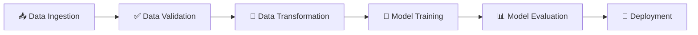
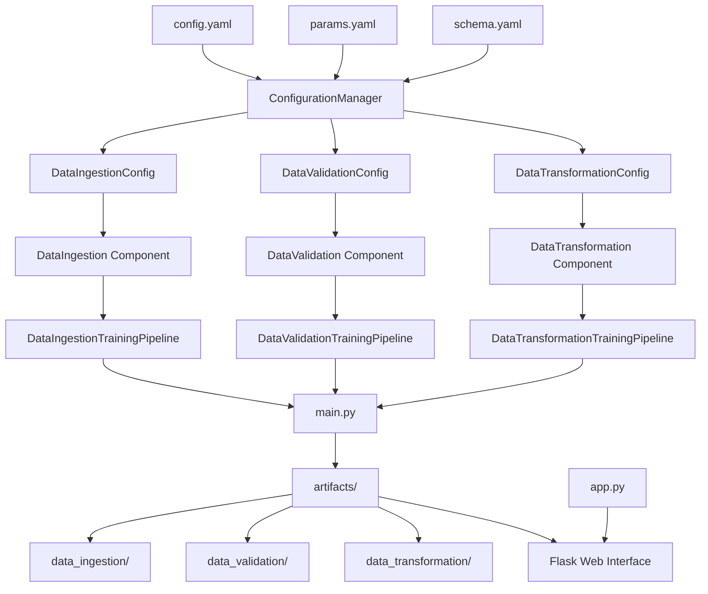
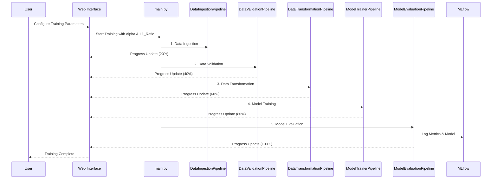

# 🍷 Wine Quality Prediction - End to End ML Project

<div align="center">
  
  
  
  
  
  
</div>

## 📊 Project Overview

This project implements a complete **Machine Learning pipeline** for predicting wine quality using various physicochemical properties. The system follows MLOps best practices with modular architecture, automated workflows, and a professional web interface.

## 🎯 Features

- 🔄 **Automated ML Pipeline** - End-to-end workflow from data ingestion to model deployment
- 📈 **Data Validation** - Comprehensive data quality checks and schema validation
- 🔧 **Feature Engineering** - Advanced data transformation and preprocessing
- 🤖 **Model Training** - ElasticNet regression with configurable hyperparameters
- 📊 **Model Evaluation** - Performance metrics with MLflow experiment tracking
- 📈 **MLflow Integration** - Model versioning and experiment management with DagsHub
- 🎨 **Modern Web Interface** - Bootstrap 5 responsive design with animations
- 🧭 **Navigation System** - Intuitive navigation between prediction and training
- ⚙️ **Interactive Training** - Parameter configuration with visual progress tracking
- 🎬 **Real-time Animations** - Visual feedback for training pipeline stages
- 🚀 **Dynamic Results** - Quality assessment with contextual descriptions
- 🐳 **Containerized** - Docker support for easy deployment

## 🏗️ ML Pipeline Architecture



## 📋 File Flow Architecture



## 🔄 Component Interaction Flow



### 🔄 Workflow Steps

| Step | Description | Status |
|------|-------------|--------|
| 1️⃣ | **Data Ingestion** - Download and extract wine quality dataset | ✅ |
| 2️⃣ | **Data Validation** - Validate schema and data quality | ✅ |
| 3️⃣ | **Data Transformation** - Feature engineering and preprocessing | ✅ |
| 4️⃣ | **Model Training** - Train ElasticNet model with custom parameters | ✅ |
| 5️⃣ | **Model Evaluation** - Performance metrics and MLflow tracking | ✅ |

## 🎨 Web Interface Features

### 🏠 **Home Page (index.html)**
- **Responsive Design** - Bootstrap 5 with mobile-first approach
- **Interactive Forms** - 11 wine parameter inputs with tooltips
- **Input Validation** - Real-time validation with visual feedback
- **Loading States** - Animated loading indicators during prediction
- **Navigation Bar** - Easy access to training and prediction pages

### 🔧 **Training Page (training.html)**
- **Parameter Configuration** - Alpha and L1 Ratio input controls
- **Visual Progress Tracking** - 5-stage pipeline animation
- **Real-time Updates** - Progress bar with step-by-step feedback
- **Form Validation** - Parameter range validation (Alpha: 0.01-2.0, L1: 0-1)
- **Interactive UI** - Dynamic form states and animations

### 📊 **Results Page (results.html)**
- **Dynamic Quality Assessment** - Color-coded quality badges
- **Contextual Descriptions** - Detailed wine quality explanations
- **Celebration Effects** - Confetti animation for excellent wines (8+)
- **Interactive Elements** - Click effects and smooth transitions
- **Quality Categories** - 6 levels from Poor to Excellent

## 📁 Project Structure

```
📦 DataScience/
├── 📂 artifacts/           # Generated outputs and models
├── 📂 config/             # Configuration files
│   ├── config.yaml        # Main configuration
│   ├── params.yaml        # Model parameters
│   └── schema.yaml        # Data schema
├── 📂 research/           # Jupyter notebooks for experimentation
├── 📂 src/Data_Science/   # Source code
│   ├── 📂 components/     # ML pipeline components
│   ├── 📂 config/         # Configuration management
│   ├── 📂 entity/         # Data classes and entities
│   ├── 📂 pipeline/       # Training and prediction pipelines
│   └── 📂 utils/          # Utility functions
├── 📂 templates/          # HTML templates
│   ├── index.html         # Main prediction interface
│   ├── training.html      # Model training interface
│   └── results.html       # Prediction results display
├── 📄 app.py             # Flask web application
├── 📄 main.py            # Main training script
└── 📄 requirements.txt   # Python dependencies
```

## 🚀 Quick Start

### 1️⃣ Clone Repository
```bash
git clone <repository-url>
cd DataScience
```

### 2️⃣ Setup Environment
```bash
python -m venv venv
source venv/bin/activate  # On Windows: venv\Scripts\activate
pip install -r requirements.txt
```

### 3️⃣ Run Training Pipeline
```bash
python main.py
```

### 4️⃣ Start Web Application
```bash
python app.py
```

### 5️⃣ Access Application
- **Main Interface**: http://localhost:8080
- **Training Interface**: http://localhost:8080/training

## 🐳 Docker Deployment

```bash
# Build Docker image
docker build -t wine-quality-predictor .

# Run container
docker run -p 8080:8080 wine-quality-predictor
```

## 📊 Dataset Information

🍷 **Wine Quality Dataset**
- **Source**: UCI Machine Learning Repository
- **Features**: 11 physicochemical properties
- **Target**: Wine quality score (0-10)
- **Samples**: ~4,900 wine samples
- **Split**: 75% training, 25% testing

### 🔍 Key Features:
- **Fixed Acidity** - Tartaric acid content (g/L)
- **Volatile Acidity** - Acetic acid content (g/L)
- **Citric Acid** - Citric acid content (g/L)
- **Residual Sugar** - Remaining sugar after fermentation (g/L)
- **Chlorides** - Salt content (g/L)
- **Free Sulfur Dioxide** - Free SO2 content (mg/L)
- **Total Sulfur Dioxide** - Total SO2 content (mg/L)
- **Density** - Wine density (g/cm³)
- **pH** - Acidity/Alkalinity level (0-14)
- **Sulphates** - Potassium sulphate content (g/L)
- **Alcohol** - Alcohol percentage by volume

## 🛠️ Technologies Used

### **Backend**
- **Python 3.11** - Core programming language
- **Flask** - Web framework for API and routing
- **Scikit-learn** - Machine learning algorithms
- **Pandas** - Data manipulation and analysis
- **NumPy** - Numerical computing
- **MLflow** - Experiment tracking and model registry
- **Joblib** - Model serialization

### **Frontend**
- **Bootstrap 5** - Responsive CSS framework
- **Font Awesome 6** - Icon library
- **Google Fonts (Poppins)** - Typography
- **Vanilla JavaScript** - Interactive functionality
- **CSS3** - Custom styling and animations

### **DevOps & Deployment**
- **Docker** - Containerization
- **DagsHub** - MLflow tracking server
- **Git** - Version control

### **Data Processing**
- **YAML** - Configuration management
- **JSON** - Data serialization
- **CSV** - Dataset format

## 🤝 Contributing

1. 🍴 Fork the repository
2. 🌿 Create feature branch (`git checkout -b feature/amazing-feature`)
3. 💾 Commit changes (`git commit -m 'Add amazing feature'`)
4. 📤 Push to branch (`git push origin feature/amazing-feature`)
5. 🔄 Open Pull Request

## 📄 License

This project is licensed under the GNU Affero General Public License v3.0 - see the [LICENSE](LICENSE) file for details.

## 🙏 Acknowledgments

- 🎓 Dataset provided by UCI Machine Learning Repository
- 🛠️ Built with Python, Flask, Bootstrap, and Scikit-learn
- 📊 MLflow integration for experiment tracking
- 🎨 Modern UI/UX with responsive design
- 🐳 Containerized with Docker for easy deployment

---

<div align="center">
  <p>Made with ❤️ for Machine Learning enthusiasts</p>
  <p>⭐ Star this repo if you found it helpful!</p>
</div>