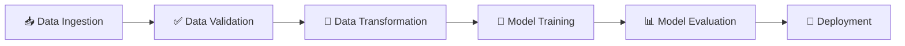

# 🍷 Wine Quality Prediction - End to End ML Project

<div align="center">
  
  
  
  
</div>

## 📊 Project Overview

This project implements a complete **Machine Learning pipeline** for predicting wine quality using various physicochemical properties. The system follows MLOps best practices with modular architecture and automated workflows.

## 🎯 Features

- 🔄 **Automated ML Pipeline** - End-to-end workflow from data ingestion to model deployment 
- 📈 **Data Validation** - Comprehensive data quality checks and schema validation
- 🔧 **Feature Engineering** - Advanced data transformation and preprocessing
- 🤖 **Model Training** - Multiple algorithms with hyperparameter tuning
- 📊 **Model Evaluation** - Detailed performance metrics and visualization
- 🚀 **Web Interface** - Flask-based prediction API
- 🐳 **Containerized** - Docker support for easy deployment

## 🏗️ ML Pipeline Architecture



### 🔄 Workflow Steps

| Step | Description | Status |
|------|-------------|--------|
| 1️⃣ | **Data Ingestion** - Download and extract wine quality dataset | ✅ |
| 2️⃣ | **Data Validation** - Validate schema and data quality | 🔄 |
| 3️⃣ | **Data Transformation** - Feature engineering and preprocessing | 🔄 |
| 4️⃣ | **Model Training** - Train ML models with cross-validation | 🔄 |
| 5️⃣ | **Model Evaluation** - Performance metrics and model comparison | 🔄 |

## 🛠️ Development Workflow

### 📋 Step-by-Step Implementation Guide

1. 📝 **Update config.yaml** - Configure paths and parameters
2. 📋 **Update schema.yaml** - Define data schema and validation rules
3. ⚙️ **Update params.yaml** - Set model hyperparameters
4. 🏗️ **Update the entity** - Define data classes and configurations
5. 🔧 **Update configuration manager** - Handle config loading in src/config
6. 🧩 **Update components** - Implement core ML components
7. 🔄 **Update pipeline** - Create training and prediction pipelines
8. 🚀 **Update main.py** - Orchestrate the entire workflow

## 📁 Project Structure

```
📦 DataScience/
├── 📂 artifacts/           # Generated outputs and models
├── 📂 config/             # Configuration files
│   ├── config.yaml        # Main configuration
│   ├── params.yaml        # Model parameters
│   └── schema.yaml        # Data schema
├── 📂 research/           # Jupyter notebooks for experimentation
├── 📂 src/Data_Science/   # Source code
│   ├── 📂 components/     # ML pipeline components
│   ├── 📂 config/         # Configuration management
│   ├── 📂 entity/         # Data classes and entities
│   ├── 📂 pipeline/       # Training and prediction pipelines
│   └── 📂 utils/          # Utility functions
├── 📂 templates/          # HTML templates for web interface
├── 📄 app.py             # Flask web application
├── 📄 main.py            # Main training script
└── 📄 requirements.txt   # Python dependencies
```

## 🚀 Quick Start

### 1️⃣ Clone Repository
```bash
git clone <repository-url>
cd DataScience
```

### 2️⃣ Setup Environment
```bash
python -m venv venv
source venv/bin/activate  # On Windows: venv\Scripts\activate
pip install -r requirements.txt
```

### 3️⃣ Run Training Pipeline
```bash
python main.py
```

### 4️⃣ Start Web Application
```bash
python app.py
```

## 🐳 Docker Deployment

```bash
# Build Docker image
docker build -t wine-quality-predictor .

# Run container
docker run -p 8080:8080 wine-quality-predictor
```

## 📊 Dataset Information

🍷 **Wine Quality Dataset**
- **Source**: UCI Machine Learning Repository
- **Features**: 11 physicochemical properties
- **Target**: Wine quality score (0-10)
- **Samples**: ~4,900 wine samples

### 🔍 Key Features:
- Fixed acidity
- Volatile acidity  
- Citric acid
- Residual sugar
- Chlorides
- Free sulfur dioxide
- Total sulfur dioxide
- Density
- pH
- Sulphates
- Alcohol

## 🤝 Contributing

1. 🍴 Fork the repository
2. 🌿 Create feature branch (`git checkout -b feature/amazing-feature`)
3. 💾 Commit changes (`git commit -m 'Add amazing feature'`)
4. 📤 Push to branch (`git push origin feature/amazing-feature`)
5. 🔄 Open Pull Request

## 📄 License

This project is licensed under the MIT License - see the [LICENSE](LICENSE) file for details.

## 🙏 Acknowledgments

- 🎓 Dataset provided by UCI Machine Learning Repository
- 🛠️ Built with Python, Flask, and Scikit-learn
- 🐳 Containerized with Docker for easy deployment

---

<div align="center">
  <p>Made with ❤️ for Machine Learning enthusiasts</p>
  <p>⭐ Star this repo if you found it helpful!</p>
</div>
